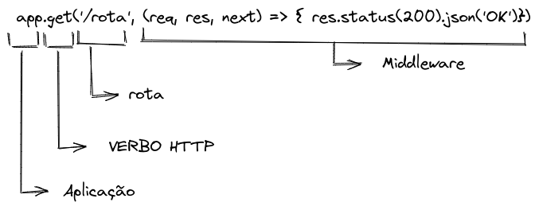

### Instruções:

Vocês devem criar um app em um arquivo `index.js`.

Os middlewares (handlers) devem ficar em outra pasta chamanda `middlewares`

E para recapitular de forma visual:



### Para rodar os testes:

```SHELL
NAME=NOME_DO_TESTE npm test
```

### Exercícios:

Inicie os exercícios criando uma aplicação Node.js com os comandos já aprendidos.

1. Crie um middleware no arquivo `middlewares/ping.js` que retorne uma resposta com status igual a 200 e a string `"pong!"` utilizando o `send`. 
- Esse middleware deve ser acessível pela rota `GET /ping`;

:warning: Para os próximos desafios, você deve enviar as respostas das requisições através do `json` (ex: `res.status(500).json(<dado ou mensagem>)`).

2. Crie um middleware (handler) no arquivo `middlewares/hello.js`. Você deve fazer com que esse middleware recebe o atributo `name` pelo body da requisição e a resposta do middleware deve ser `{ "message": "Hello, <name>!" }`, onde `<nome do usuário>` deve ser o nome enviado. O status da resposta deve ser `201`. 
- Esse middleware deve ser acessível pela rota `POST /hello`;

3. Crie um middeware no arquivo `middlewares/greeting.js`. Você deve fazer com que esse middleware recebe o atributos `name` e `age` pelo body da requisição. Esse middleware deve seguir a seguinte lógica:

- Se o valor do atributo `age` for maior ou igual a 18 deve a resposta deve ter o status 200 e o json `{ "message": "Hello, <name>!" }`
- Se o valor do atributo `age` for menor que 18 a resposta deve ter o status 401 e o json `{ "message": "Unauthorized" }`.

- Esse middleware deve ser acessível pela rota `POST /greeting`.

:warning: Para os próximos desafios, será usando o arquivo `simpsons.json`, não modifique o conteúdo desse arquivo, exceto quando o requisito pedir por isso.

:warning: Utilize o modulo `fs` do Node para ler e escrever nesse arquivo.

4. Crie um middleware no arquivo `middlewares/getSimpsons.js` que faça com que a resposta tenha o status `200` e
   retorne o conteúdo do arquivo `simpsons.json`.
   - Esse middleware deve ser acessível pela rota `GET /simpsons`

5. Crie um middleware no arquivo `middlewares/getSimpsonById.js` seguindo as seguintes especifições:

- Deve receber o id como **parâmetro de rota**;
- Se existir um simpson correspondente ao id passado a resposta da requisição deve ter o status 200 e retornar o objeto do simpson como json.
- Se não existir um simpson correspondente ao id passado a resposta da requisição deve ter o status 404 e retornar o seguinte json: `{ message: 'Simpson not found!'}`

- Esse middleware deve ser acessível através da rota `GET /simpsons/:id`

6. Crie um middleware no arquivo `middlewares/createSimpson.js` seguindo as seguintes especifições:

- Deve ser capaz de receber os parâmetros `id` e `name` no corpo da requisição.
- Deve ser capaz de adicionar um objeto com os dois parâmetros recebidos no arquivo `simpsons.json`.
- A resposta da requisição deve ser `{ message: 'Simpson criado com sucesso!' }` com o status `201`.

- Esse middleware deve ser chamado pela rota `POST /simpsons`.

7. Crie um middleware no arquivo `middlewares/validateIdSimpson.js` seguindo as seguintes especifições:

- Deve ser capaz de receber o parâmetro `id` do `req.body`.
- Se já existir um simpson com id passado deve retornar o json `{ message: 'Não é possível cadastrar esse simpson!'}` com o status `500`.
- Caso não exista, deve chamar a função `next` do middleware.

- Esse middleware deve ser chamado pela rota `POST /simpsons` **antes** do middleware construído no requisito 6 (`createSimpsons`).

8. Crie um middleware no arquivo `middlewares/validateNameSimpson.js` seguindo as seguintes especifições:

- Deve ser capaz de receber o parâmetro `name` do `req.body`.
- Se o valor de `name` for igual a vazio ou nulo deve retornar o json `{ message: 'Nome é obrigatório'}` e status 500.
- Caso `name` seja válido deve chamar a função `next` do middleware.
- Esse middleware deve ser chamado pela rota `POST /simpsons` 
  - **antes** do middleware construído no requisito 6 (`createSimpson`) 
  - e **depois** do middleware construído no requisito 7 (`validateNameSimpson`).
